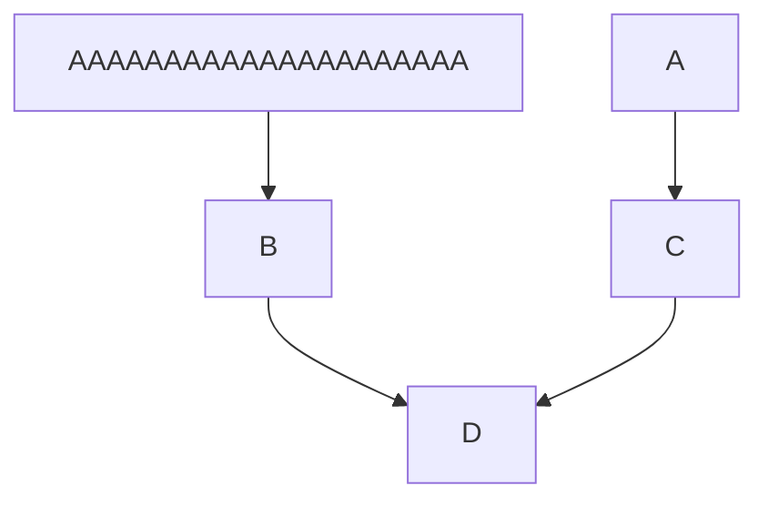

#### 逻辑配置可视化

+ 展示逻辑关系图 （8月9号）
+ 展示节点的关键信息 （8月20号）
+ 对逻辑关系图中的节点进行增、删、改 （9月16号）

#### 流程图基本图形结构

+ 开始、结束： 圆角矩形
+ 工作环节、行动方案： 矩形
+ 输入、输出： 平行四边形
+ 工作流方向： 箭头

##### 画图库

+ mermaid

  > 1. 没有绑定事件的api
  > 2. 

https://mermaidjs.github.io/mermaid-live-editor/#/edit/eyJjb2RlIjoiZ3JhcGggVERcbkFbQ2hyaXN0bWFzXSAtLT58R2V0IG1vbmV5fCBCKEdvIHNob3BwaW5nKVxuQiAtLT4gQ3tMZXQgbWUgdGhpbmt9XG5DIC0tPnxPbmV8IERbTGFwdG9wXVxuQyAtLT58VHdvfCBFW2lQaG9uZV1cbkMgLS0-fFRocmVlfCBGW2ZhOmZhLWNhciBDYXJdXG4iLCJtZXJtYWlkIjp7InRoZW1lIjoiZGVmYXVsdCJ9fQ