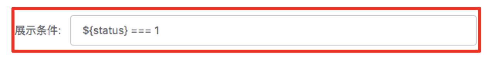

目前以我查资料，及断点分析，得出的结论：js引擎在执行代码时，首先会静态分析所有的导出模块（关键字export模块），然后import拿的只是引用，会根据代码实际执行情况改变。也就是说如果代码里使用了以下代码（a.js）

```
// 导出去的是 表达式，lt在导出去时，已经确定了
export const lt =
  (window.isQQEmbedded || window.isWeixin) && !window.isMiniprogram
    ? "wq"
    : "m";
```

我在`b.js`里`import`了`lt`。js的执行先会执行`a.js`里声明的`lt`，`lt`后面的值也会执行，结果就是`'m'`，因为此时，`iosIfo`并没有真正的执行，所以window下没有挂载任何东西。

改进： 

```
// 导出一个函数，它的值在真正执行的时候才确定
export const lt = () => ((window.isQQEmbedded || window.isWeixin) && !window.isMiniprogram
    ? "wq"
    : "m");
  
```

在`b.js`里调用`lt（）`就可以拿到正确的值。因为`osInfo`此时已在入口文件执行，接口里去执行`lt()`时，window下已经挂载了各种判断。

当然，也能改进如何导出`osInfo`，具体改进还得研究研究


## 代办事项

+ [x]  Chalk、commander写一个命令行demo
+ [ ]  inquirer写一个demo


### 换肤H5

+ [x] 更换head中title的文案 => 'DIY你的京东专属皮肤'
+ [ ] H5上线需要更改短连接
+ [ ] 小气泡开关提示，更换文案

### 早会

+ [x] 5Tab凸出正常、尺寸问题


## 人人都是PLUS - 宣传页

+ [x] 底部开通按钮呼吸效果展示 （已完成）
+ [x] 分享屏蔽qq、qq空间、新浪微博 （已完成）
+ [x] 降级处理 （不处理）
+ [x] 骨架屏 （已增加）
+ [x] 分享链接需要改、分享出去的图片是否要处理 （已处理）
+ [x] 分享弹窗全面屏，取消上移 （不处理）


+ [x] 微信小程序 - 商详跳转 
+ [x] 头部try-catch
+ [ ] Jdp d pro


### 猎户座

######  逻辑可视化需求点拆分

> + [x] 逻辑可视化 - 逻辑单元及其对应操作的可视化开发 （已完成）
> + [x] 逻辑可视化 - 开始/完成节点可视化开发 （已完成）
> + [x] 逻辑可视化 - 逻辑单元矩形文本自适应模块开发 （已完成）
> + [x] 逻辑可视化 - 各个模块自适应调整位置 （已完成）
> + [x] 逻辑可视化 - 新增逻辑单元、新增完成节点、删除逻辑单元、删除完成节点 （已完成）
> + [x] 逻辑可视化 - 配置逻辑单元、配置完成节点 （已完成）
> + [x] 逻辑可视化 - 根据输入的数据，高亮某一条完整的链路 （已完成）
> + [ ] 逻辑可视化 - 撤销功能
> + [ ] 逻辑可视化 - 放大缩小保存


+ 2019.10.28 封装组件 - 使用svg完成逻辑单元可视化，及其相对应的操作
+ 2019.10.29 可视化操作，从开始按钮往下延续
+ 2019.10.30 设计可视化单元的数据结构，进而对各个模块之间的连线
+ 2019.10.31 对矩形文本框单元进行实现（给定宽）
+ 2019.11.01 增加操作结束单元
+ 2019.11.02 增加操作结束单元、删除逻辑单元、删除完成单元


##### 配置化平台-通过服务端下发字段控制组件(内容)显示的方案

**需求**

在配置项中通过某个字段来确定是否展示某个组件，或组件内的内容

**方案**

在配置中增加一个condition字段，包含内容如下：

```json
{
  ...,
  "condition": [
  	{
      "name": "condition1",
      "label": "条件1",
      "type": "text"
    },
		...
  ],
  "static": [
    ...
  ],
  ...
}
```

读取这个字段，展示在配置项中。当配置项中填写表达式后，在render.js中通过eval方式将其进行解析为boolean值，进而控制组件的显示与否。

**展示效果**



**可行性**

1. 使用占位符的方案可以解决这个需求。

2. 配置规则： 

   单个表达式中通过占位符（__**${}**__）来取值

   单个表达式通过 **===**、**!==**、**>=**、**<=**、**>**、**<**连接；

   过个表达式之间通过**&&** **||**进行连接

**存在的问题**

1. 需要研发开配置这块的内容。
2. 错误的占位符可能造成代码注入的问题。

